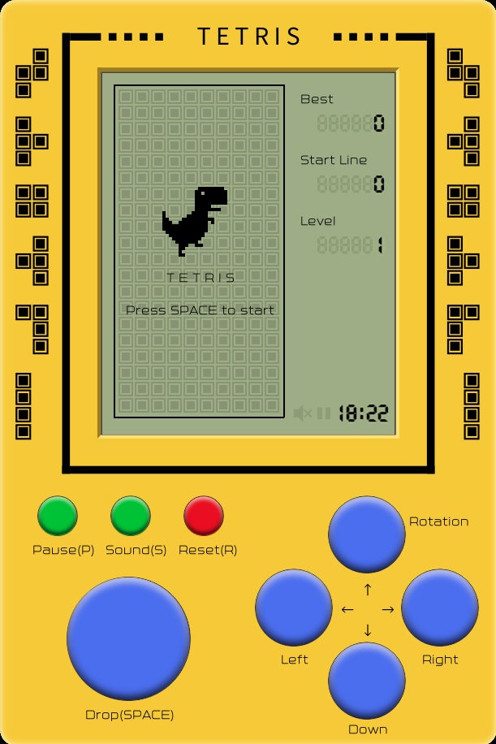
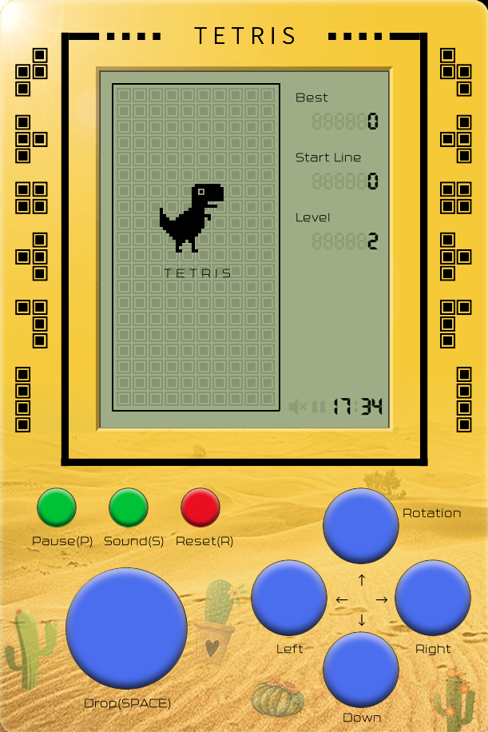
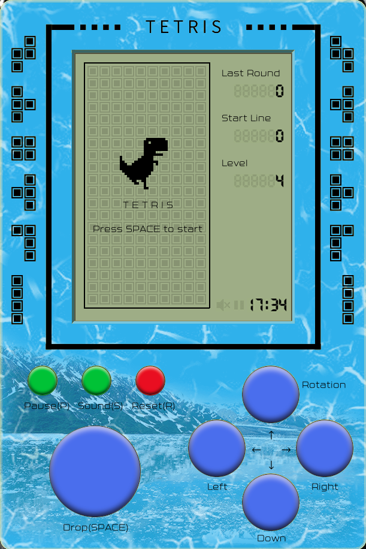
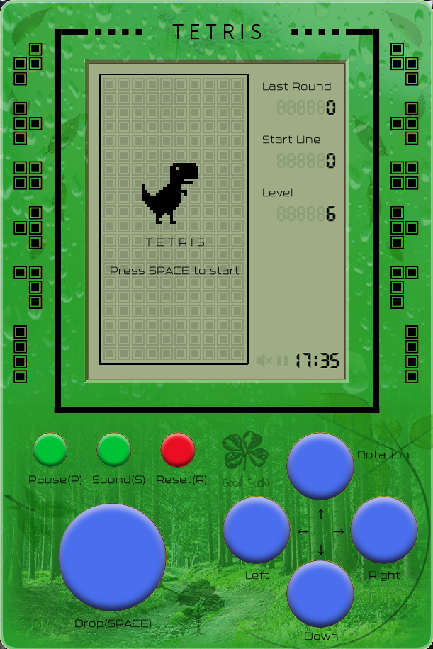
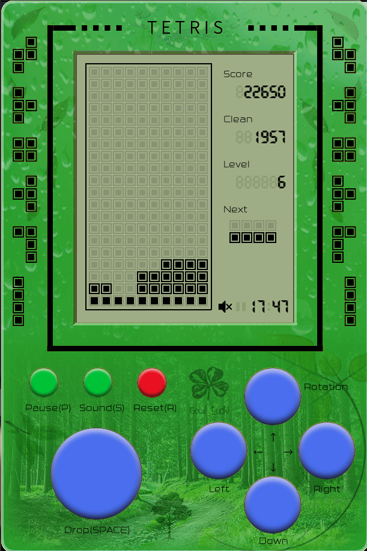
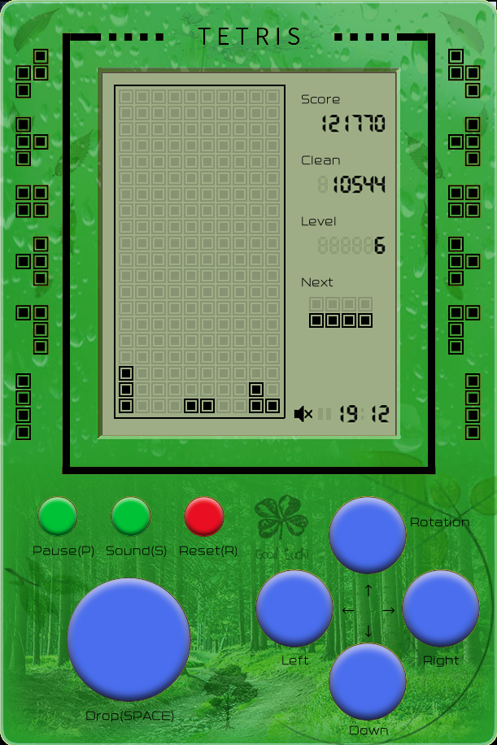

<!--
 * @Author         : yanyongyu
 * @Date           : 2020-05-14 22:26:04
 * @LastEditors    : yanyongyu
 * @LastEditTime   : 2020-06-06 19:13:19
 * @Description    : None
 * @GitHub         : https://github.com/yanyongyu
-->

# PyTetris


## Table of Contents

- [PyTetris](#pytetris)
  - [Table of Contents](#table-of-contents)
  - [Overview](#overview)
  - [Screenshots](#screenshots)
  - [Play the Game](#play-the-game)
    - [Install](#install)
    - [Start](#start)
    - [How to Play](#how-to-play)
  - [Pierre Dellacherie](#pierre-dellacherie)
    - [Landing Height](#landing-height)
    - [Eroded Piece Cells Metric](#eroded-piece-cells-metric)
    - [Board Row Transitions](#board-row-transitions)
    - [Board Column Transitions](#board-column-transitions)
    - [Board Buried Holes](#board-buried-holes)
    - [Board Wells](#board-wells)
    - [Total](#total)
    - [Priority](#priority)
    - [Result Preview](#result-preview)
  - [Project Development Setup](#project-development-setup)

## Overview

Simple tetris game made by pygame

Inspired by [react-tetris](https://github.com/chvin/react-tetris)

AI algorithm: Pierre Dellacherie ([El-Tetris](https://imake.ninja/el-tetris-an-improvement-on-pierre-dellacheries-algorithm/))

## Screenshots


  



## Play the Game

### Install

```shell
pip3 install pytetris
```

### Start

Run the following command in the environment which you installed the pytetris package or under the project folder:

```shell
python -m pytetris
```

or you can run the project in the project folder by

```shell
poetry run game
```

### How to Play

In the home page, you can use `←→` or click the button to change to start level and use `↑↓` to change the start random line number.

- `↑` : Rotate the piece
- `←→` : Move the piece left or right
- `↓` : Speed up the piece
- `SPACE` : Drop down the piece
- `P` : Pause the game
- `S` : Mute control
- `R` : Reset the game (will loss current score)
- `A` : Make AI on or off

## Pierre Dellacherie

Pierre Dellacherie is a one-piece algorithm.

Six main features:

### Landing Height

The height where the piece is put. Top or center of the piece is both ok.

Example:

:white_large_square::white_large_square::white_large_square::white_large_square::white_large_square::blue_square::white_large_square::white_large_square::white_large_square::white_large_square:  
:white_large_square::white_large_square::black_large_square::black_large_square::blue_square::blue_square::black_large_square::black_large_square::white_large_square::white_large_square:  
:black_large_square::black_large_square::black_large_square::black_large_square::blue_square::black_large_square::black_large_square::black_large_square::black_large_square::black_large_square:  
:black_large_square::white_large_square::white_large_square::black_large_square::black_large_square::black_large_square::black_large_square::black_large_square::black_large_square::black_large_square:

Height: `4` or `3`

### Eroded Piece Cells Metric

The number of rows eliminated × The number of the squares the piece contributed

Example:

:white_large_square::white_large_square::white_large_square::white_large_square::white_large_square::blue_square::white_large_square::white_large_square::white_large_square::white_large_square:  
:white_large_square::white_large_square::black_large_square::black_large_square::blue_square::blue_square::black_large_square::black_large_square::white_large_square::white_large_square:  
:black_large_square::black_large_square::black_large_square::black_large_square::blue_square::black_large_square::black_large_square::black_large_square::black_large_square::black_large_square:  
:black_large_square::white_large_square::white_large_square::black_large_square::black_large_square::black_large_square::black_large_square::black_large_square::black_large_square::black_large_square:

Eliminated lines: `1`

Contribute: `1`

Eroded Piece Cells Metric: `1 × 1 = 1`

### Board Row Transitions

The total number of row transitions. A row transition occurs when an empty cell is adjacent to a filled cell on the same row and vice versa.

**Tips:** Both sides of the wall is concerned as filled.

Example:

:negative_squared_cross_mark::white_large_square::white_large_square::black_large_square::black_large_square::white_large_square::white_large_square::black_large_square::black_large_square::white_large_square::white_large_square::negative_squared_cross_mark:

Single Row Transitions: `6`

### Board Column Transitions

The total number of column transitions. A column transition occurs when an empty cell is adjacent to a filled cell on the same column and vice versa.

**Tips:** Both sides of the wall is concerned as filled.

Example:

:negative_squared_cross_mark:  
:white_large_square:  
:black_large_square:  
:black_large_square:  
:white_large_square:  
:black_large_square:  
:negative_squared_cross_mark:

Single Column Transitions: `4`

### Board Buried Holes

The total number of column holes. A hole is an empty cell that has at least one filled cell above it in the same column.

Example:

:white_large_square:  
:black_large_square:  
:black_large_square:  
:white_large_square:  
:black_large_square:

Single Column Holes: `1`

### Board Wells

The total number of column wells. A well is a succession of empty cells such that their left cells and right cells are both filled.

**Tips:** As long as there are filled cells on both sides, the empty cell is concerned as well.

Example:

:white_large_square::white_large_square::black_large_square:  
:black_large_square::white_large_square::black_large_square:  
:black_large_square::black_large_square::black_large_square:  
:black_large_square::white_large_square::black_large_square:  
:black_large_square::white_large_square::black_large_square:

Wells: `(1) + (1+2) = 4`

### Total

The evaluation function is a linear sum of all the above features. Bigger value will be better.

| Feature                   | Weight              |
| ------------------------- | ------------------- |
| Landing Height            | -4.500158825082766  |
| Eroded Piece Cells Metric | 3.4181268101392694  |
| Board Row Transitions     | -3.2178882868487753 |
| Board Column Transitions  | -3.2178882868487753 |
| Board Buried Holes        | -7.899265427351652  |
| Board Wells               | -3.3855972247263626 |

### Priority

priority = 100 \* moving_steps + rotation_times

We choose the action which priority is lower if there are two or more same evaluation actions.

### Result Preview




## Project Development Setup

Clone the repository then install dependencies.

```shell
poetry install --no-root
```

or you can install the dependencies using pip:

```shell
pip3 install pygame numpy
```
